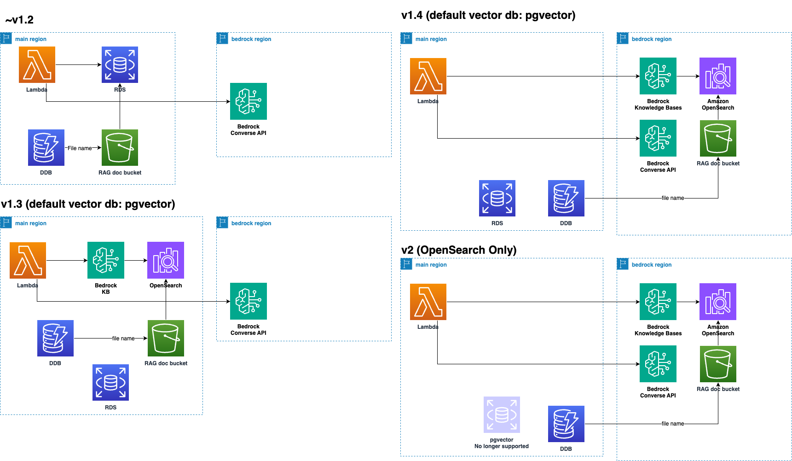

# Migration Guide (v1 to v2)

## TL;DR

- **For users of v1.2 or earlier**: Upgrade to v1.4 and recreate your bots using Knowledge Base (KB). After a transition period, once you confirm everything works as expected with KB, proceed with upgrading to v2.
- **For users of v1.3**: Even if you are already using KB, it is **strongly recommended** to upgrade to v1.4 and recreate your bots. If you are still using pgvector, migrate by recreating your bots using KB in v1.4.
- **For users who wish to continue using pgvector**: Upgrading to v2 is not recommended if you plan to continue using pgvector. Upgrading to v2 will remove all resources related to pgvector, and future support will no longer be available. Continue using v1 in this case.
- Note that **upgrading to v2 will result in the deletion of all Aurora-related resources.** Future updates will focus exclusively on v2, with v1 being deprecated.

## Introduction

### What will happen

The v2 update introduces a major change by replacing pgvector on Aurora Serverless and ECS-based embedding with [Amazon Bedrock Knowledge Bases](https://docs.aws.amazon.com/bedrock/latest/userguide/knowledge-base.html). This change is not backward compatible.

### Why this repository has adopted Knowledge Bases and discontinued pgvector

There are several reasons for this change:

#### Improved RAG Accuracy

- Knowledge Bases use OpenSearch Serverless as the backend, allowing hybrid searches with both full-text and vector search. This leads to better accuracy in responding to questions that include proper nouns, which pgvector struggled with.
- It also supports more options for improving RAG accuracy, such as advanced chunking and parsing.
- Knowledge Bases have been generally available for almost a year as of October 2024, with features like web crawling already added. Future updates are expected, making it easier to adopt advanced functionality over the long term. For example, while this repository has not implemented features like importing from existing S3 buckets (a frequently requested feature) in pgvector, it is already supported in KB (KnowledgeBases).

#### Maintenance

- The current ECS + Aurora setup depends on numerous libraries, including those for PDF parsing, web crawling, and extracting YouTube transcripts. In comparison, managed solutions like Knowledge Bases reduce the maintenance burden for both users and the repository's development team.

## Migration Process (Summary)

We strongly recommend upgrading to v1.4 before moving to v2. In v1.4, you can use both pgvector and Knowledge Base bots, allowing a transition period to recreate your existing pgvector bots in Knowledge Base and verify they work as expected. Even if the RAG documents remain identical, note that the backend changes to OpenSearch may produce slightly different results, though generally similar, due to differences like k-NN algorithms.

By setting `useBedrockKnowledgeBasesForRag` to true in `cdk.json`, you can create bots using Knowledge Bases. However, pgvector bots will become read-only, preventing the creation or editing of new pgvector bots.


In v1.4, [Guardrails for Amazon Bedrock](https://aws.amazon.com/jp/bedrock/guardrails/) are also introduced. Due to regional restrictions of Knowledge Bases, the S3 bucket for uploading documents must be in the same region as `bedrockRegion`. We recommend backing up existing document buckets before updating, to avoid manually uploading large numbers of documents later (as S3 bucket import functionality is available).

## Migration Process (Detail)

The steps differ depending on whether you are using v1.2 or earlier, or v1.3.



### Steps for users of v1.2 or earlier

1. **Backup your existing document bucket (optional but recommended).** If your system is already in operation, we strongly recommend this step. Back up the bucket named `bedrockchatstack-documentbucketxxxx-yyyy`.

2. **Update to v1.4**: Fetch the latest v1.4 tag, modify `cdk.json`, and deploy. Follow these steps:

   1. Fetch the latest tag:
      ```bash
      git fetch --tags
      git checkout tags/v1.4.0
      ```
   2. Modify `cdk.json` as follows:
      ```json
      {
        ...,
        "useBedrockKnowledgeBasesForRag": true,
        ...
      }
      ```
   3. Deploy the changes:
      ```bash
      cdk deploy
      ```

3. **Recrate your bots**: Recreate your bots on Knowledge Base with the same definitions (documents, chunk size, etc.) as the pgvector bots. If you have a large volume of documents, restoring from the backup in step 1 will make this process easier. **Note that some features are not available on Knowledge Bases, such as web crawling and YouTube transcript support.** Also, keep in mind that using Knowledge Bases will incur charges for both Aurora and Knowledge Bases during the transition.

4. **Upgrade to v2**: After the release of v2, fetch the tagged source and deploy as follows (this will be possible once released):
   ```bash
   git fetch --tags
   git checkout tags/v2.0.0
   cdk deploy
   ```

### Steps for users of v1.3

As mentioned earlier, in v1.4, Knowledge Bases must be created in the bedrockRegion due to regional restrictions. Therefore, you will need to recreate the KB. If you have already tested KB in v1.3, recreate the bot in v1.4 with the same definitions. Follow the steps outlined for v1.2 users.
